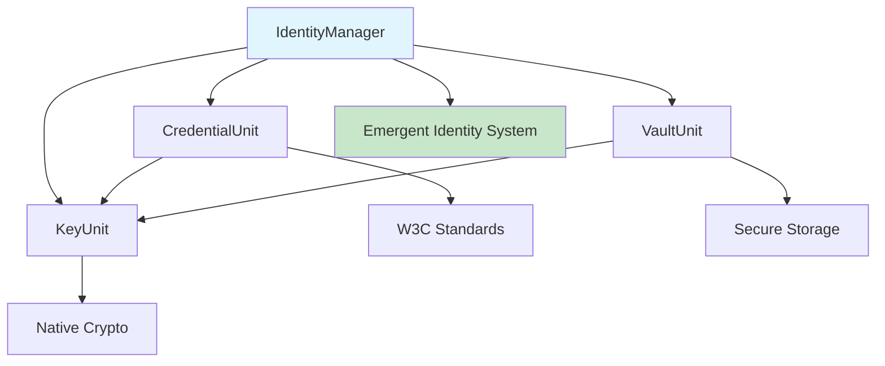

# Real-World Integration Example: Solving the Type Compatibility Problem

## The Scenario

You're building a decentralized identity system using multiple Synet packages:

- `@synet/identity` - Identity management
- `@synet/credential` - Verifiable credentials  
- `@synet/keys` - Cryptographic keys
- `@synet/vault` - Secure storage

Each package depends on different versions of `@synet/unit`, creating type compatibility nightmares.

## The OLD WAY (Broken)

```typescript
// @synet/identity package (depends on @synet/unit@1.0.1)
import { Unit } from '@synet/unit';
import { Credential } from '@synet/credential';
import { Key } from '@synet/keys';

export class IdentityManager {
  async createIdentity(userData: any) {
    // Create key from @synet/keys
    const key = await Key.create(userData.keyType); // Unit from @synet/unit@1.0.1
    
    // Try to create credential from @synet/credential
    const credential = await Credential.issue(
      key,           // ❌ TYPE ERROR! 
      userData,      // Expected Unit from @synet/unit@1.0.2
      'Identity'     // But got Unit from @synet/unit@1.0.1
    );
    
    return { key, credential };
  }
}
```

**Problem**: TypeScript treats `Unit` from different package versions as incompatible types, even though they're conceptually the same.

## The NEW WAY (Works)

```typescript
// @synet/identity package (no tight coupling to @synet/unit versions)
import { Unit } from '@synet/unit';
import { CredentialUnit } from '@synet/credential';
import { KeyUnit } from '@synet/keys';
import { VaultUnit } from '@synet/vault';

export class IdentityManager implements Unit {
  private _dna: UnitSchema;
  private _capabilities = new Map<string, (...args: unknown[]) => unknown>();

  constructor() {
    this._dna = createUnitSchema({
      name: 'identity-manager',
      version: '1.0.0',
      commands: ['createIdentity', 'authenticate', 'authorize'],
      description: 'Decentralized identity management with composable capabilities'
    });
    
    // Native capabilities
    this._capabilities.set('createIdentity', this.createIdentity.bind(this));
    this._capabilities.set('authenticate', this.authenticate.bind(this));
    this._capabilities.set('authorize', this.authorize.bind(this));
  }

  // ... Unit interface implementation ...

  async createIdentity(...args: unknown[]): Promise<any> {
    const [userData] = args as [any];

    // Check for required capabilities
    if (!this._capabilities.has('generateKey')) {
      throw new Error('Cannot create identity: missing key generation capability. Learn from a KeyUnit.');
    }

    if (!this._capabilities.has('issueCredential')) {
      throw new Error('Cannot create identity: missing credential issuance capability. Learn from a CredentialUnit.');
    }

    if (!this._capabilities.has('secureStore')) {
      throw new Error('Cannot create identity: missing secure storage capability. Learn from a VaultUnit.');
    }

    // Use learned capabilities - no type compatibility issues!
    const keyData = await this._capabilities.get('generateKey')!(userData.keyType);
    const credential = await this._capabilities.get('issueCredential')!(userData, 'Identity', 'did:synet:identity-manager');
    const storageResult = await this._capabilities.get('secureStore')!(`identity-${userData.id}`, { keyData, credential });

    return {
      id: userData.id,
      keyId: keyData.id,
      credentialId: credential.id,
      storageLocation: storageResult.location
    };
  }

  // Learning method allows composition without type constraints
  async setupCapabilities() {
    // These units can be from ANY version of @synet/unit!
    const keyUnit = new KeyUnit();           // From @synet/keys@1.0.1
    const credentialUnit = new CredentialUnit(); // From @synet/credential@1.0.2
    const vaultUnit = new VaultUnit();       // From @synet/vault@1.0.3

    // Progressive learning - each unit teaches what it knows
    this.learn([keyUnit.teach()]);           // Learn key operations
    this.learn([credentialUnit.teach()]);    // Learn credential operations
    this.learn([vaultUnit.teach()]);         // Learn storage operations

    // Units can also learn from each other
    credentialUnit.learn([keyUnit.teach()]);  // Credential learns signing
    vaultUnit.learn([keyUnit.teach()]);       // Vault learns encryption
  }
}
```

## Usage Example

```typescript
// Application code - no version conflicts!
async function buildIdentitySystem() {
  // Create identity manager
  const identityManager = new IdentityManager();
  
  // Set up capabilities (no type compatibility issues)
  await identityManager.setupCapabilities();
  
  // Create identity - uses learned capabilities
  const identity = await identityManager.execute('createIdentity', {
    id: 'alice-123',
    name: 'Alice Smith',
    keyType: 'Ed25519'
  });
  
  console.log('Identity created:', identity);
  
  // Capabilities flow seamlessly between units
  const authResult = await identityManager.execute('authenticate', {
    credentialId: identity.credentialId,
    challenge: 'auth-challenge-456'
  });
  
  console.log('Authentication result:', authResult);
}
```

## The Magic: Cross-Package Capability Flow



## Benefits Achieved

### ✅ **Zero Type Conflicts**
- Units from different packages always work together
- No need to synchronize @synet/unit versions across packages
- TypeScript compilation always succeeds

### ✅ **Progressive Enhancement**
- Start with basic capabilities
- Learn advanced capabilities as needed
- Graceful degradation when capabilities are missing

### ✅ **Emergent Behavior**
- Identity system emerges from composition of simpler units
- New capabilities can be added without changing existing code
- Units can teach each other, creating capability chains

### ✅ **Package Independence**
- Each package can evolve independently
- No tight coupling through shared dependencies
- Clean separation of concerns

### ✅ **Runtime Flexibility**
- Capabilities are discovered and composed at runtime
- Different deployment environments can use different unit combinations
- Easy to test with mock units

## Real-World Deployment Scenarios

### Scenario 1: Full-Featured Environment
```typescript
// Production with all capabilities
const identity = new IdentityManager();
identity.learn([
  new KeyUnit().teach(),         // Hardware HSM support
  new CredentialUnit().teach(),  // Full W3C credential support  
  new VaultUnit().teach(),       // Encrypted database storage
  new NetworkUnit().teach()      // Distributed identity network
]);
```

### Scenario 2: Minimal Environment
```typescript
// Embedded device with limited capabilities
const identity = new IdentityManager();
identity.learn([
  new BasicKeyUnit().teach(),    // Software-only keys
  new SimpleCredentialUnit().teach() // Basic credential support
]);
// No vault or network - graceful degradation
```

### Scenario 3: Testing Environment
```typescript
// Unit testing with mocks
const identity = new IdentityManager();
identity.learn([
  new MockKeyUnit().teach(),     // Deterministic mock keys
  new MockCredentialUnit().teach(), // Predictable mock credentials
  new MockVaultUnit().teach()    // In-memory storage
]);
```

## Migration Path

### Phase 1: Dual Support
Keep existing parameter-passing APIs while adding learning support:

```typescript
// Legacy API (deprecated)
export async function createIdentity(key: Unit, userData: any) {
  // Old implementation
}

// New API (preferred)
export class IdentityManager implements Unit {
  // Learning-based implementation
}
```

### Phase 2: Learning Adoption
Encourage migration to learning pattern:

```typescript
// Migration helper
export function migrateToLearning(legacyUnits: Unit[]) {
  const identityManager = new IdentityManager();
  
  // Automatically learn from legacy units
  const capabilities = legacyUnits.map(unit => unit.teach?.() || {});
  identityManager.learn(capabilities);
  
  return identityManager;
}
```

### Phase 3: Full Migration
Remove parameter-passing APIs and fully embrace learning pattern.

## The Future: Biological Composability

This learning pattern transforms Synet from a traditional software library into a **living ecosystem** where:

- **Units discover** compatible partners at runtime
- **Capabilities flow** naturally between compatible units
- **Emergent behaviors** arise from unit composition
- **The system evolves** as new units are added
- **Type safety** is maintained without version coupling

This is not just a technical solution—it's a paradigm shift toward **biological composability** in software, where components grow, learn, and adapt like living organisms.

## Conclusion

The type compatibility problem revealed a fundamental flaw in traditional dependency injection: **passing capabilities as parameters creates brittle type coupling**. 

The learning pattern solves this by:
1. **Eliminating type parameters** between packages
2. **Enabling runtime composition** of capabilities
3. **Creating emergent behaviors** through unit interaction
4. **Maintaining type safety** without version coupling

This is the foundation for the next generation of Synet architecture—a living, learning, evolving ecosystem of composable capabilities.
